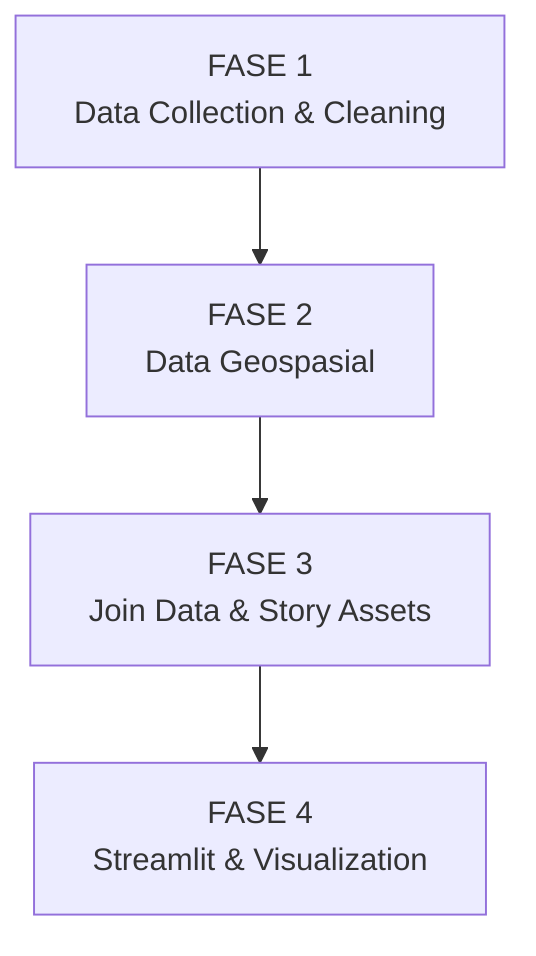

# Visualisasi Kesejahteraan Kabupaten/Kota Indonesia

**Project UAS Visualisasi Data dan Informasi 2025/2026**  
Program Studi Komputasi Statistik — Politeknik Statistika STIS

**Muhammad Muhlis Aditya Nur Wahid**  
NIM: **222313249**  
Kelas: **3SD1**

## Live Application

Aplikasi dapat diakses melalui:

**https://visualisasi-data-uas-muhlis000.streamlit.app/**

Repository:

**https://github.com/muhlis000/visdat-welfare-indonesia**

---

## Tentang Proyek

Proyek ini menyajikan **web scrollytelling interaktif** untuk mengeksplorasi
perbedaan kondisi kesejahteraan antar kabupaten/kota di Indonesia pada
tahun **2024 dan 2025**.

Kesejahteraan pada proyek ini tidak diringkas menjadi satu indeks baru,
melainkan dieksplorasi melalui beberapa indikator resmi Badan Pusat
Statistik (BPS), terutama:

- persentase penduduk miskin;
- jumlah penduduk miskin;
- Indeks Kedalaman Kemiskinan (P1);
- Indeks Keparahan Kemiskinan (P2);
- Indeks Pembangunan Manusia (IPM); dan
- PDRB per kapita.

Aplikasi dirancang sebagai cerita visual bertahap sehingga pengguna dapat
melihat persoalan dari tiga sudut pandang utama:

1. **di mana** perbedaan kesejahteraan terjadi;
2. **bagaimana** indikator-indikator kesejahteraan saling berhubungan; dan
3. **bagaimana** jumlah penduduk miskin tersusun menurut hierarki wilayah.


## Workflow Proyek

Pipeline proyek terdiri dari empat fase utama:


---

## Jenis Visualisasi

Proyek memenuhi tiga kategori utama visualisasi pada UAS Visualisasi Data
dan Informasi.

### 1. Visualisasi Geospasial

#### Choropleth Map

Choropleth digunakan untuk menampilkan **persentase penduduk miskin**
kabupaten/kota.

Warna merepresentasikan proporsi penduduk miskin, bukan jumlah absolut
penduduk miskin. Pengguna dapat:

- mengganti tahun 2024 dan 2025;
- melakukan zoom dan pan;
- melihat tooltip kabupaten/kota; dan
- mengikuti narasi per wilayah/pulau.

#### Heatmap Kemiskinan

Heatmap digunakan untuk memberikan perspektif berbeda, yaitu
**jumlah penduduk miskin secara absolut**.

Bobot visual menggunakan transformasi akar kuadrat agar wilayah dengan
jumlah penduduk sangat besar tidak sepenuhnya mendominasi tampilan.

Penggunaan choropleth dan heatmap secara berdampingan membantu membedakan
dua konsep penting:

- **persentase penduduk miskin** menunjukkan seberapa besar bagian
  penduduk yang hidup di bawah garis kemiskinan;
- **jumlah penduduk miskin** menunjukkan berapa banyak orang miskin
  secara absolut.

---

### 2. Visualisasi Multivariat

Analisis multivariat menggunakan lima indikator utama:

- persentase penduduk miskin;
- P1;
- P2;
- IPM; dan
- PDRB per kapita.

#### Principal Component Analysis (PCA)

PCA digunakan untuk mereduksi lima variabel menjadi dua komponen utama.

Sebelum PCA, variabel distandardisasi menggunakan `StandardScaler` agar
perbedaan satuan tidak mendominasi hasil.

Titik yang berdekatan pada bidang PCA menunjukkan kabupaten/kota dengan
profil indikator yang relatif mirip.

PCA pada aplikasi digunakan untuk **eksplorasi struktur data**, bukan untuk
membentuk klaster formal.

#### Parallel Coordinates

Parallel coordinates memperlihatkan profil multidimensi setiap
kabupaten/kota secara langsung.

Setiap garis merepresentasikan satu kabupaten/kota melalui lima indikator
yang telah dinormalisasi ke rentang yang dapat dibandingkan secara visual.

Visualisasi ini membantu melihat:

- pola indikator antardaerah;
- wilayah yang menyimpang dari pola umum; dan
- kombinasi kemiskinan, pembangunan manusia, dan kondisi ekonomi.

#### Correlation Heatmap

Correlation heatmap menampilkan korelasi Pearson antarindikator.

Visualisasi ini digunakan untuk melihat kecenderungan hubungan linear
antarvariabel, misalnya hubungan antara:

- persentase penduduk miskin dan P1;
- P1 dan P2;
- kemiskinan dan IPM; serta
- IPM dan PDRB per kapita.

Korelasi pada aplikasi bersifat **deskriptif** dan tidak ditafsirkan sebagai
hubungan sebab-akibat.

---

### 3. Visualisasi Hierarki

Struktur wilayah dibentuk sebagai:

```text
Indonesia
└── Pulau
    └── Provinsi
        └── Kabupaten/Kota
```
#### Treemap

Treemap menggunakan:

- luas kotak untuk merepresentasikan jumlah penduduk miskin;
- warna untuk merepresentasikan persentase penduduk miskin.

Visualisasi ini memudahkan perbandingan kontribusi jumlah penduduk miskin
antarwilayah dalam ruang yang relatif ringkas.

#### Sunburst

Sunburst menampilkan struktur yang sama dalam bentuk radial.

